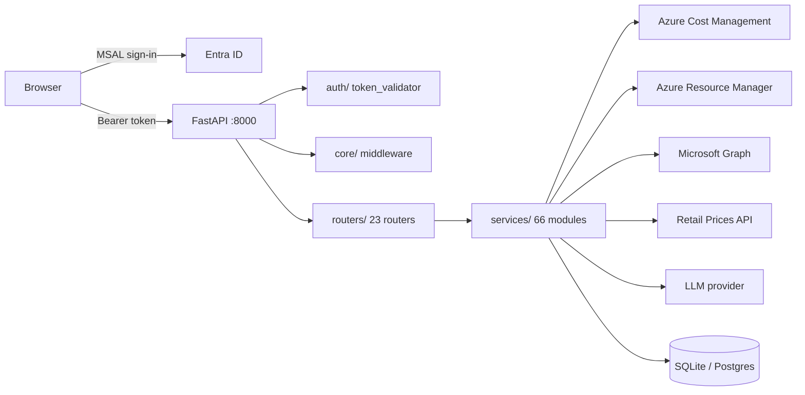
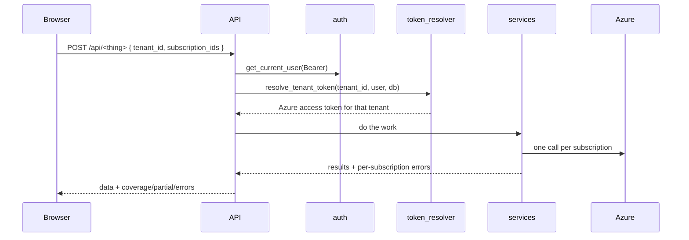

# Platform Map — every feature, and how it works

> Companion to `01-architecture-audit.md` (what is wrong), `02-gap-analysis.md`
> (what is missing) and `03-target-architecture.md` (where it is going).
> **This document answers a different question: what exists today, where it
> lives, and what path a request takes through it.**
>
> It is written at module level on purpose. The exact request/response shape of
> every endpoint is generated from the code and is always more current than
> prose can be — read it at `http://localhost:8000/docs`, or in the app itself
> on the **API Catalog** page (`/apis`), which is the same schema rendered for
> people who are not reading Swagger.

---

## 1. The shape of the thing



Three rules the codebase holds itself to, visible everywhere:

1. **`main.py` composes, it does not decide.** Config, middleware, error
   handlers, route mounting. Nothing else.
2. **Routers are HTTP surfaces, services are the domain.** A router validates,
   resolves a token, calls a service, shapes a response. If it contains
   arithmetic, that is a smell.
3. **A missing number is never a zero.** Partial failures travel with the data
   (`coverage`, `partial`, `errors`) rather than being dropped once one
   subscription succeeds. A partial total that looks complete is the single
   most expensive bug this domain can produce.

---

## 2. Backend

### 2.1 Cross-cutting (`backend/core/`, `backend/auth/`)

| Module | What it does |
| --- | --- |
| `config.py` | Settings + `production_config_errors()` — refuses to start with dev defaults in prod |
| `db.py` | SQLite connection lifecycle, `init_db()`, `get_db()` dependency |
| `pg.py`, `pg_auth.py` | Postgres path (see `scripts/migrate_to_postgres.py`) |
| `errors.py` | `ApiError` + four handlers so nothing escapes as an untyped 500 |
| `middleware.py` | `RateLimitMiddleware`, `RequestContextMiddleware` (correlation id), `SecurityHeadersMiddleware` |
| `versioning.py` | Mounts every router twice: legacy `/api/...` and `/api/v1/...`, with a `Sunset` header on the legacy pair |
| `logging_config.py` | Structured logging |
| `pagination.py` | Shared page/limit contract |
| `auth/token_validator.py` | Validates the Entra ID JWT (signature, audience, issuer) |
| `auth/dependencies.py` | `get_current_user` — the dependency on essentially every route |

Also mounted at app level, outside any router: `/api/me` (GET/PATCH),
`/api/me/sessions`, `/api/me/sign-out`, `/api/me/export` (data export),
`/api/health`, and — in production — the built frontend as static files with an
SPA catch-all.

### 2.2 The token path

Nearly every feature starts the same way:



`services/token_resolver.py` is the chokepoint. A user may have several tenants
connected; the token is resolved per request from the tenant named in the body,
never from ambient state.

### 2.3 Cost engine — the most load-bearing code in the repo

`services/cost_client.py` is the only thing that talks to Cost Management, and
it is deliberately paranoid, because that API is metered **per subscription
scope** and will throttle an account that fans out naively.

- **Global gate** — `MAX_CONCURRENT_QUERIES = 10`
- **Two-tier cache** — memory + `cost_cache.py`, with in-flight de-duplication
  so ten pages asking the same question produce one call
- **Per-scope pacing** — `SCOPE_RATE_PER_MINUTE = 6`, adaptive: `_penalise()`
  on a 429, `_reward()` on success
- **Per-scope cooldown** — honours `Retry-After`, capped at `MAX_RETRY_DELAY`
- **Patience** — `MAX_PACE_WAIT = 25s` normally, but `MAX_PATIENT_WAIT = 90s`
  when the cache is cold, because failing fast is only kind when the caller has
  something cached to show instead
- **Honest refusals** — `RateLimited(paced=True)` means *our own queue*, not
  Azure. `friendly_error()` says so. Telling a user Azure is throttling them
  when Azure has said nothing of the kind sends them hunting a quota problem
  that does not exist.

Around it: `cost_periods.py` (period + comparison maths, including
`previous_period` which works for month, rolling and custom windows alike),
`resource_cost.py`, `usage_detail.py`, `analysis.py`, `coverage.py`,
`fx_rates.py`.

### 2.4 Feature map — router → service → page

| Domain | Router (`/api/…`) | Key services | Frontend route |
| --- | --- | --- | --- |
| Tenants / onboarding | `tenants`, `integrations` | `integration_service`, `setup_guide`, `permissions_manifest` | `/onboarding`, `/settings` |
| Subscriptions | `subscriptions` | `azure_mgmt`, `management_groups` | selector in the shell |
| Cost query & explorer | `costs` | `cost_client`, `analysis`, `pricing`, `coverage` | `/explorer`, `/`, `/compare` |
| Anomalies | `anomalies` | `anomalies`, `anomaly_causes`, `anomaly_tracking`, `cost_periods` | `/anomalies` |
| Services breakdown | `services` | `analysis`, `azure_names` | folded into `/explorer` |
| CSV / Excel import | `upload` | `csv_parser` | `/explorer` (upload tab) |
| Bandwidth & egress | `bandwidth` | `bandwidth`, `bandwidth_traffic`, `azure_metrics` | `/bandwidth` |
| BoQ / estimates | `boq` | `boq_builder`, `boq_parser`, `boq_chat_service`, `estimate_export`, `retail_prices` | `/boq` |
| Commitments | `commitments` | `commitments`, `reservations` | `/commitments` |
| Orphaned resources | `orphaned` | `orphaned`, `lifecycle`, `resource_cost` | `/orphaned` |
| Compute right-sizing | `compute` | `compute_intel`, `vm_resize`, `azure_metrics` | `/compute` |
| Prices | `prices` | `pricing`, `price_history`, `retail_prices` | `/boq`, drill-downs |
| Estate scan & search | `scans`, `search` | `scanner`, `search`, `estate_tools`, `tagging` | `/estate`, `/search` |
| Change tracking | `changes` | `changes`, `scanner` | `/changes` |
| Resource / group timeline | `timeline` | `lifecycle`, `changes`, `activity` | drawers on `/search`, `/changes`, `/resource-groups` |
| Activity log | `activity` | `activity` | `/activity` |
| Security posture | `security` | `security_fetch`, `security_posture` | `/security`, `/defender`, `/advisor`, `/policy` |
| Access & identity | `security`, `team` | `graph_identity`, `graph_directory`, `access_review`, `access_change`, `access_accept` | `/access-identity`, `/access-history` |
| Network | `network` | `network_topology`, `network_insights` | `/network` |
| Provisioning (IaC) | `provision` | `provision_service`, `provision_chat_service`, `iac_service` | `/provision`, `/deploy` |
| Remediation actions | `actions` | `actions`, `azure_cli` | action buttons across pages |
| Team & workspace | `team` | `team_service`, `user_service`, `user_sessions` | `/team`, `/account` |
| Admin | `admin` | `backup`, `user_service` | `/admin` (admins only) |
| Guided help | `guide` | `setup_guide` | inline help |

### 2.5 Shared Azure plumbing

`azure_mgmt.py` (ARM calls), `azure_retry.py` (backoff), `azure_errors.py`
(turns an ARM fault into a sentence a human can act on), `azure_names.py`
(meter/SKU → readable name), `azure_cli.py`, `azure_metrics.py` (Monitor).

`llm_client.py` / `llm_dialogue.py` / `llm_errors.py` back the two conversational
surfaces — BoQ chat and provisioning chat — and nothing else.

---

## 3. Frontend

React 18 + Vite (`:5174`), Tailwind, `zustand` (`useAppStore`), `recharts`,
`lucide-react`, `react-router-dom`, `react-hot-toast`, MSAL for sign-in.

```
src/
  api/client.js        one fetch layer, attaches the bearer token
  pages/               32 route-level screens
  components/
    Common/            DetailPanel, ResourceTimeline, GroupTimeline, …
    Security/          SecurityShell: PageHeader, NeedsSelection, Failure, Empty, Chips
    Commitments/       CommitmentRules, CommitmentDetail
    Boq/ Provision/ …
  utils/               commitments.js, commitmentRules.js, friendlyError, formatters
tests/                 42 files, 1144 tests (vitest)
```

**Every page is lazy-loaded.** `App.jsx` gates on three states before any route
renders: account load failure (offers *retry* first, sign-out last, because the
usual cause is a token that just needs renewing), workspace-with-no-tenant, and
onboarding.

**Shared page contract.** Almost every screen composes
`PageHeader → NeedsSelection | Failure | Empty | data`, so "you have not picked a
subscription", "the call failed" and "there is genuinely nothing here" never
look alike.

**Cross-cutting drawers.** `ResourceTimeline` (one resource: created, changed,
deleted, cost swings) is reachable from Change Tracking *and* Global Search.
`GroupTimeline` (a whole resource group: 7/30/90-day or custom window, cost
graph + KPIs, "What matters" vs "Full activity log") opens from Resource Groups.

---

## 4. Running it

```bash
bash start.sh            # both
bash start-backend.sh    # :8000, uvicorn --reload
bash start-frontend.sh   # :5174, vite
```

```bash
# backend  — 1824 tests
cd backend && .venv/bin/pytest -q

# frontend — 1144 tests across 42 files
cd frontend && npx vitest run tests/ && npx eslint src
```

There is no `python` on this machine — use `python3`, and the venv binary
directly for tests.

---

## 5. Known constraints worth knowing before you debug

- **Activity Log retention is 90 days.** Anything older is not missing, it is
  gone. `GroupTimeline` caps its window at `RETENTION_DAYS = 90` for this reason.
- **Azure bills by UTC day.** Timelines bucket by UTC, not the reader's local
  day, or events slide onto the wrong bar for anyone east or west of UTC.
- **`Microsoft.BillingBenefits/savingsPlans` returns 403** on this tenant. That
  is a permissions gap, not a bug — see `permissions_manifest.py`.
- **Cost Management is metered per subscription.** Selecting fewer subscriptions
  or a narrower range is a real fix, not a fob-off, and the error copy says so.

---

## 6. What each feature actually does

Grouped by the question it answers. The design note under each one is not
decoration — it is the constraint that explains why the feature behaves the way
it does, and it is taken from the module's own docstring.

### 6.1 "What are we spending?"

**Cost Explorer** (`/explorer` → `costs` → `cost_client`, `analysis`, `pricing`)
Query Cost Management across any set of subscriptions over N months, grouped by
service, resource, region, tag or meter. `POST /api/costs` returns the
aggregated summary; `POST /api/costs/rows` returns cost **and usage quantity**
per meter, one row per month. That second shape exists so a rise can be split
into *used more* versus *charged more per unit* — you cannot tell those apart
from cost alone, and the remedy is completely different.
→ *Every response carries `coverage`. Per-subscription failures used to be
collected and then dropped whenever one subscription succeeded, which returned a
partial total looking exactly like a complete one.*

**Dashboard** (`/`) — the estate at a glance: current spend, trend, the
headline findings from the other pages.

**Compare** (`/compare`) — month-over-month diffing. Works identically on live
Azure data and on an uploaded CSV/Excel file, because `upload` → `csv_parser`
produces the same row shape `/api/costs/rows` does.

**CSV / Excel import** (`upload`) — bring your own invoice export and get the
same analysis without connecting a tenant at all.

**Bandwidth** (`/bandwidth` → `bandwidth`, `bandwidth_traffic`, `azure_metrics`)
Egress and data-transfer charges, joined to Monitor traffic metrics — the
"why is our network bill this big" page.

**Prices** (`prices` → `pricing`, `price_history`, `retail_prices`)
Azure Retail Prices lookups plus recorded history, so a rate change is visible
as a rate change rather than as a mysterious cost increase.

### 6.2 "What is wrong?"

**Anomalies** (`/anomalies` → `anomalies` → `anomalies`, `anomaly_causes`,
`anomaly_tracking`, `cost_periods`)
Detects spikes, drops, newly-started and newly-stopped spend between a selected
period and the one before it, classifies each finding, attempts a cause, and
tracks status so a known anomaly stays acknowledged across reloads.
→ *Both periods are read **once**, in parallel across subscriptions, and every
figure is derived from those two reads. An anomaly page that costs one Azure
call per finding is a page that gets rate limited the moment it becomes useful.*

**Orphaned** (`/orphaned` → `orphaned` → `orphaned`, `lifecycle`,
`resource_cost`) — unattached disks, idle public IPs, empty NICs, stale
snapshots and the like, each priced so the waste is a number, not an adjective.
→ ***Strictly read-only.** "Deleting cloud resources from a cost tool is a
foot-gun: the blast radius is unbounded and the audit trail lives somewhere
else." It reports what to remove and leaves removal to the owner.*

**Compute right-sizing** (`/compute` → `compute` → `compute_intel`, `vm_resize`)
The VM fleet, what it costs, and what it actually did — by joining **four**
independent sources: Resource Graph (what exists, size, region, power state),
Cost Management (last month's cost), Azure Monitor (real utilisation), and
Retail Prices (what the proposed smaller size would cost). It then proposes a
resize, and `POST /api/compute/resize` can perform it (workspace admin only).
→ *Three of the four sources are optional. A missing Monitor permission produces
a fleet list with "not enough data" per VM, not an error page — and `sources`
reports which reads succeeded so the UI can say **why** a column is empty.*

**Commitments** (`/commitments` → `commitments` → `commitments`, `reservations`)
Every reservation and savings plan: utilisation over a 7/30/90-day window, spend,
wastage, days to expiry, what it covers, Azure's purchase recommendations, and
what happens if you cancel each one (`CommitmentRules` / `cancellationImpact`).
→ *Aimed at two specific failure modes — a commitment lapses and the rate
silently reverts, or it sits underused. "Every number here is either measured or
absent."*

### 6.3 "What changed, and who did it?"

**Estate scan** (`/estate` → `scans` → `scanner`, `estate_tools`, `tagging`)
Captures a full point-in-time snapshot of every resource. This is the
foundation: *Azure keeps no history*, so search over deleted resources,
point-in-time browsing and change tracking are all questions only a stored
snapshot can answer.

**Global Search** (`/search` → `search_router` → `search`) — find any resource
in the estate by name, type, tag or group, **including ones that no longer
exist**. Clicking a result opens its full history.

**Change Tracking** (`/changes` → `changes`) — diff any two scans: what was
added, removed or modified, field by field, with an ignore list for noise.
→ *Reads only stored snapshots, so it **never calls Azure and cannot be
throttled** — it still answers when Cost Management is refusing everyone else.*

**Timelines** (`timeline` → `lifecycle`, `changes`, `activity`, `resource_cost`)
Two drawers, reachable from Search, Change Tracking and Resource Groups:
- `ResourceTimeline` — one resource end to end: when it appeared, everything
  that changed it, what it cost around each change, and who did it.
- `GroupTimeline` — a whole resource group over a 7/30/90-day or custom window:
  a cost graph with KPIs, plus two tabs — *What matters* (failures, deletes,
  cost movements) and *Full activity log*.
→ *Deliberately separate from `/api/changes` so the fast always-available diff
keeps that property. Cost and Activity Log enrichment are **best effort**: a
timeline without prices is still a timeline.*

**Activity Log** (`/activity` → `activity`) — the raw Azure Activity Log,
filterable by subscription, resource group, caller, operation and outcome.
→ *Retention is **90 days**. Older entries are not missing, they are gone.*

### 6.4 "Is it safe?"

**Security posture** (`/security`, `/defender`, `/advisor`, `/policy` →
`security` → `security_fetch`, `security_posture`) — five views over four Azure
providers: RBAC auditing, Azure Advisor, Defender for Cloud, and Azure Policy.
→ *Two decisions shape all of it. **(1)** Every endpoint writes a snapshot as it
reads, because Advisor, Defender and Policy only report the present tense — so
"what did this look like last month", the question every security programme is
judged on, is unanswerable unless somebody wrote the previous reading down.
**(2)** A missing permission degrades the answer and **names itself**, because
an empty security page reads as "nothing is wrong".*

**Access & Identity** (`/access-identity`, `/access-history` → `security`,
`team` → `graph_identity`, `graph_directory`, `access_review`, `access_change`,
`access_accept`) — who has what rights, over-privileged and stale assignments,
guest accounts, and a review workflow where a proposed change is raised,
accepted and then applied — with the history kept.

**Network** (`/network` → `network` → `network_topology`, `network_insights`)
VNets, subnets, peerings, gateways and NSGs, drawn.
→ ***Read-only, deliberately.** "A diagram that can also edit the network is a
diagram people stop trusting to be a faithful record."*

### 6.5 "Build and change things"

**BoQ / estimates** (`/boq` → `boq` → `boq_builder`, `boq_parser`,
`boq_chat_service`, `estimate_export`, `retail_prices`) — build a Bill of
Quantities for a planned deployment, priced from the Retail Prices API; import
an existing BoQ file; refine it conversationally; export it as a workbook.
Also compares a BoQ against what is actually running.

**Provisioning / IaC** (`/provision`, `/deploy` → `provision` →
`provision_chat_service`, `provision_service`, `iac_service`) — describe what
you want, get a draft specification, review it, then deploy.
→ *The two routes are deliberately different. `/chat` produces a **draft** and
spends one unit of the customer's own daily model limit. `/deploy` creates
resources and starts a monthly charge, so it takes **a specification, not a
sentence**, requires an explicit confirmation flag, is refused for team members,
and runs on the caller's own delegated token — **Azure's RBAC decides, nothing
here elevates anybody**.*

**Remediation actions** (`actions` → `actions`, `tagging`) — the one door for
write operations: tagging today, more later. It publishes a **catalogue of what
this product can change** (served by code, so the capability list cannot drift
from the docs), records every attempt in one table so "what has this workspace
changed" is a single query, and honours `Idempotency-Key` so a retried request
is not a second change.
→ *The three older write endpoints — `compute/resize`, `security/access/*`,
`provision/deploy` — were intentionally **not** migrated: they have their own
tests, and moving three working destructive features at once to prove a pattern
is a bad trade.*

### 6.6 "Run the workspace"

**Onboarding & Settings** (`/onboarding`, `/settings` → `tenants`,
`integrations`, `guide`) — connect an Azure tenant, check granted permissions
against `permissions_manifest.py`, configure your own LLM endpoint and its daily
limit, and follow the guided setup.

**Team** (`/team` → `team` → `team_service`) — invite people into the workspace
with view access. They see the owner's connected tenants; they cannot deploy.

**Account** (`/account` → app-level `/api/me`) — profile, active sessions,
sign-out everywhere, and a full data export.

**API Catalog** (`/apis`) — the generated OpenAPI schema rendered for humans.
This is the authoritative endpoint list; prose goes stale, this cannot.

**Admin** (`/admin` → `admin` → `backup`, `user_service`) — platform admins
only: users, workspaces, and database backups.
